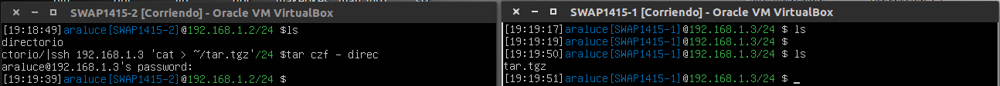
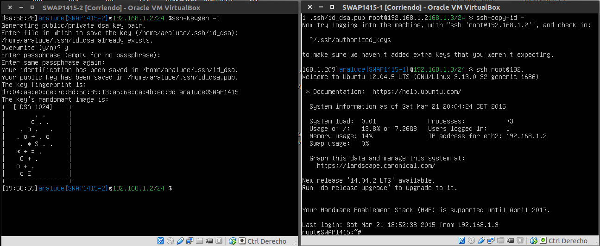
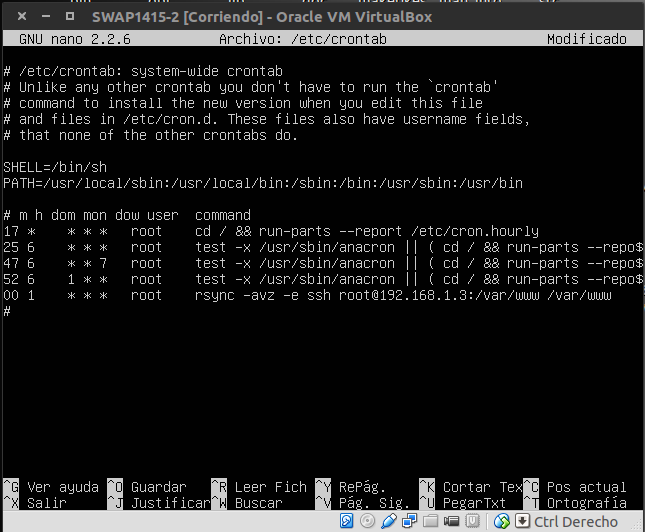

## Practica 2: _Replicar datos entre servidores_

#### Probar el funcionamiento de la copia de archivos por ssh

1. He creado un directorio _"directorio/"_ en la máquina 1
2. He ejecutado en la misma máquina el comando:

***
tar czf - directorio/ | ssh 192.168.1.3 'cat > ~/tar.tgz'
***

3. Con ese comando he comprimido el directorio _"directorio/"_ directamente en la máquina 1 a través del comando ssh

### Clonado de una carpeta entre las dos máquinas

1. En la máquina 2 tenemos un directorio _"directorio"_ que contiene un archivo _"archivo.txt"_ y nuestro objetivo es clonarlo en la máquina 1

2. Desde la máquina 1 he ejecutado el comando:

***
rsync -avz -e ssh root@192.168.1.2:/home/araluce/directorio /home/araluce/
*** 

3. Como resutado de eso, el directorio _"directorio"_ ha sido clonado en la máquina 1 y podemos comprobar que el archivo _"archivo.txt"_ se encuentra dentro del directorio

### Configuración de ssh para acceder sin que solicite contraseña

En este ejercicio voy a mostrar como crear un par de claves _(pública,privada)_ en una máquina y copiar desde otra máquina la clave pública de la primera máquina

1. En la máquina 2 creamos el juego de claves con el siguiente comando:

***
ssh-keygen -t dsa
***

2. Desde la máquina 1, copiamos la clave pública de la máquina 2 con el siguiente comando:

***
ssh-copy-id -i .ssh/id_dsa.pub root@192.168.1.2
***

3. Una vez copiada la clave pública, intentamos acceder a la máquina 2 por ssh para comprobarlo

***
ssh root@192.168.1.2
***

### Establecer una tarea en _cron_ que se ejecute cada hora para mantener actualizado el contenido del directorio _/var/www_ entre las dos máquinas

1. La máquina 2 es la que va a lanzar el evento, por lo que necesitaremos la IP de la máquina 1 _(192.168.1.3)_

2. En la máquina 2 vamos a modificar el fichero /etc/crontab y añadimos la siguiente línea al final

00 1 *** root rsync -avz e ssh root@192.168.1.3:/var/www /var/www