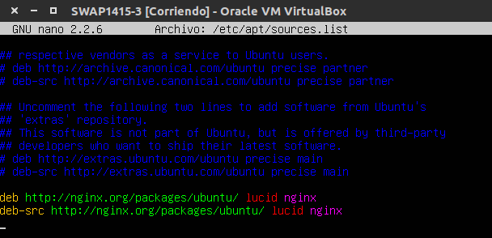
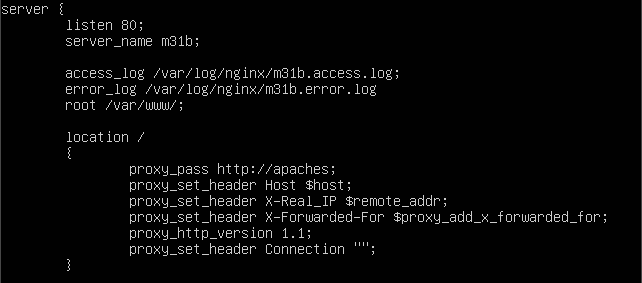
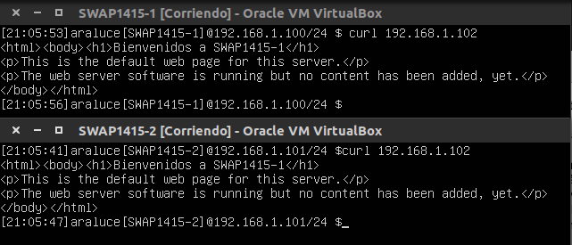
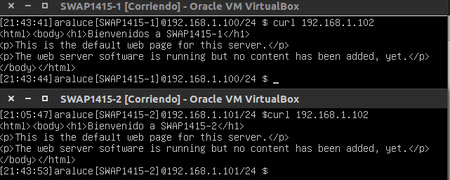

## Practica 3: _Balanceo de carga_

Para esta práctica debemos configurar una tercera máquina, a la que llamamos _SWAP1415-3_, como balanceador de carga. Para ello nos dan dos opciones de balanceadores software (_nginx, haproxy_) que existen entre muchos otros.

El proceso de instalación y configuración de balanceadores descrito a continuación se llevará a cabo en _SWAP1415-3_. Pues bien, manos a la obra.

####1. _nginx_

Para instalar _nginx_ debemos importar la clave del repositorio de la siguiente manera:

cd /tmp/
wget http://nginx.org/keys/nginx_signing.key
apt-key add /tmp/nginx_signing.key
rm -f /tmp/nginx_signing.key

Después, como root, agregamos estas dos líneas al fichero source.list:

Después de guardar, con un _update_ y un install de nginx tendremos todo instalado. Ahora tenemos una máquina balanceadora que no está balanceando tráfico. Vamos a definir el/los grupos de máquinas con los que contamos para redirigirles el tráfico y a darles mayor cantidad a las máquinas más potentes o el mismo según nuestros intereses.

En nuestro caso tenemos dos servidores web _SWAP1415-1_ y _SWAP1415-2_. El primero es el doble de potente que el segundo, con lo cual queremos redirigirle al primero el doble de tráfico que al segundo. Sus IP's son 192.168.1.100 y 192.168.1.101 respectivamente. Muy bien, pues vamos a decirle a nginx con lo que contamos y cómo queremos hacerlo.

Editamos el fichero _/etc/nginx/conf.d/default.conf_ y definimos el grupo de servidores:

Y definimos la sección server (para que nginx utilice el grupo apaches que hemos definido) como sigue:

Antes de comprobar si funciona o no tendremos que 

Ahora reiniciamos el servicio _nginx_ y comprobamos haciendo _curl [IP máquina balanceadora]_, en mi caso:

curl 192.168.1.102

Y nos devolverá lo siguiente:

Podemos observar cómo se redirige la mayor parte del tráfico a la máquina 1.

####2. _haproxy_

Instalamos _haproxy_

Y modificamos el fichero de configuración propio del balanceador de la siguiente manera:

Hecho esto, ya estamos listos para comprobar desde las máquinas _SWAP1415-1_ y _SWAP1415-2_ que el balanceador funciona correctamente, pero antes apagamos el servicio de _nginx_ y validamos la nueva configuración de _haproxy_

Y ahora si:

