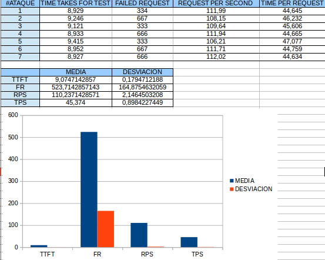
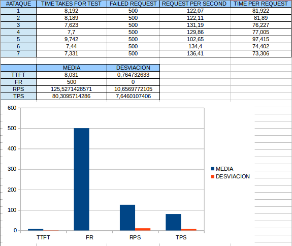
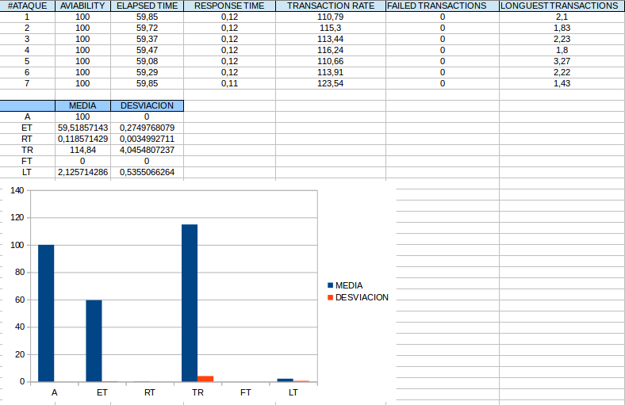
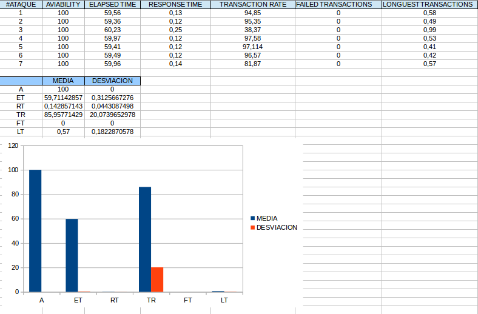
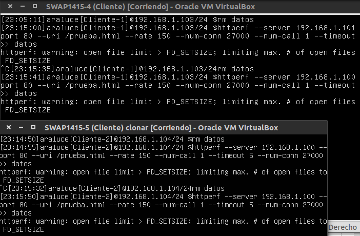

## Practica 3: _Comprobar el rendimiento de servidores web_

Recursos disponibles para esta práctica:
Servidor Web 1: 192.168.1.100
Servidor Web 2: 192.168.1.101
Balanceador   : 192.168.1.102
Cliente 1     : 192.168.1.103
Cliente 2     : 192.168.1.104

Antes de realizar ningún tipo de test, creamos una página en SW-1 y SW-2 contra la que atacar para hacer las pruebas de benchmarking:

####1. _Apache Benchmark (ab)_

En este apartado se vana ver involucrados el Servidor Web 1 _SWAP1415-1_ y el Cliente 1 _SWAP1415-4_.

Para comprobar que podemos acceder bien a la página prueba.html hacemos un curl al SW-1:

Hacemos el ataque, en mi caso he realizado 7 ataques. 1000 peticiones a prueba.html con concurrencia 5 y cada uno de los reportes se guarda en datos.txt para su posterior estudio.

Los resultados obtenidos en forma de tabla y gráfica son los siguientes:

Ahora realizamos el mismo ataque al balanceador. Comenzamos con el balanceador nginx. 

Para eso debemos parar el servicio _haproxy_ e iniciar el servicio _nginx_

Los resultados para _nginx_ son:

Ahora paramos el servicio _nginx_ e iniciamos el servicio _haproxy_, los resultados obtenidos son los siguientes:

#### 2. _siege_

Instalamos _siege_ con el comando apt.

##### 2.1. Ataque al SW-1 _(SWAP1415-1)_ 
Procedemos a atacar directamente al servidor web desde la máquina cliente con este comando:

Los resultados son los siguientes:

##### 2.2. Ataque al balanceador nginx (SWAP1415-3)

Para esta sección haremos lo mismo que las veces anteriores. Paramos el servicio _haproxy_ y activamos _nginx_

El ataque lo realizamos de la misma forma pero al servidor 192.168.1.102. Los resultados que arrojan estos ataques son:

##### 2.2. Ataque al balanceador nginx (SWAP1415-3)

Los resultados que arrojan estos ataques son:

#### 3. _httperf_
Para poder instalar _httperf_ debemos añadir a /etc/apt/sources.list el siguiente repositorio:

No podremos instalar el paquete hasta que no hagamos un _"sudo apt-get update"_. Después de esto ya podremos instalar _httperf_con apt como haríamos con cualquier otro programa.

Después de esto, procedemos a realizar los ataques directamente al servidor web 1 _SWAP1415-1_ desde los clientes 1 y 2 simultáneamente (_SWAP1415-4_, _SWAP1415-5_)hasta completar un número de muestras suficiente.

Se ve que el ataque con el cliente 1 se realiza a 192.168.1.101, pero los resultados en las tablas y gráficas son ataques realizados desde los dos clientes a 192.168.1.100. 

Los resultados obtenidos son los siguientes:

Es interesante el dato que arroja el ataque 7. Teniendo en cuenta que cada ataque se ha realizado simultáneamente con dos clientes y que el ataque 7, al ser impar, se ha realizado de forma independiente, el número de errores es mucho menor que el de otros ataques ejecutados desde dos clientes simultáneamente. 

Puesto que los demás ataques se han realizado simultáneamente, este último dato va a descuadrar todas las estadísticas, así que lo pondremos como un dato interesante pero no lo metemos en el grupo de datos a los que vamos a hacer la media y desviación. 

