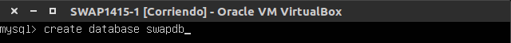
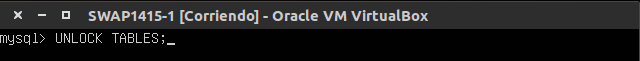
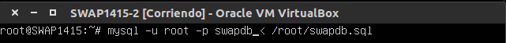
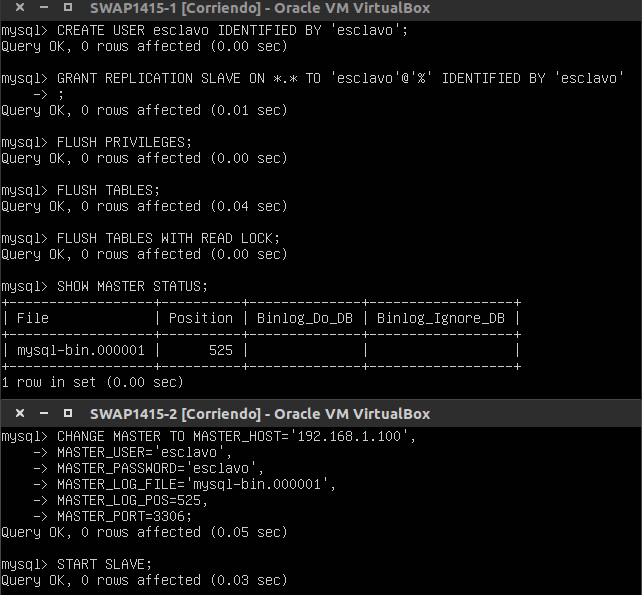

## Practica 5: _Replicación de bases de datos MySQL_

Recursos disponibles para esta práctica:
BD_server1: 192.168.1.100
BD_Server2: 192.168.1.101

##### 5.1 Creación de BD

Vamos a crear la tabla _datos_ en una base de datos en _BD_server1_ llamada _SWAPDB_




##### 5.2 Replica y recuperación de la BD _swapdb_

En esta sección crearemos una copia de seguridad y la pasaremos a **_BD_server2_** y le indicaremos a esta última que restaure los datos.

Antes de hacer la copia que va a copiar nuestra máquina2 bloqueamos la inserción de datos en la base de datos creada para que no se inserten datos mientras realizamos la copia.


Realizamos la copia en nuestro directorio **/root/**


Y desbloqueamos para poder insertar datos



Ahora desde la máquina **_BD_server2_** copiamos el archivo sql a nuestro directorio **/root/**


Antes de restaurar la copia debemos crear una BD con idéntico nombre a la que deseamos importar.


Y rellenamos los datos importando el fichero **_swapdb.sql_** que ahora se encuentra en nuestro directorio /root/



##### 5.3 Realizar configuración maestro-esclavo para replicación de datos automática

En un entorno real necesitamos que estas copias se realicen de forma automática. Podemos, para ello, configurar dos máquinas de modo que una de ellas asimile el rol de maestro y la otra de esclavo.

La configuración del maestro es sencilla. Simplemente debemos modificar como **root** el fichero de configuración de mysql **_/etc/mysql/my.conf_**. Para ello las siguientes directivas deben quedar así:

```
#bind-address 127.0.0.1
log_error = /var/log/mysql/error.log
server-id = 1
log_bin = /var/log/mysql/bin.log
```

Sin olvidarnos de reiniciar el servicio
``/etc/init.d/mysql restart``

Ahora debemos configurar de la misma forma la máquina que adquiere rol de esclavo.

El fichero a configurar es el mismo, con las mismas directivas salvo que el valor de **server-id** será dos. Ésto es ``server-id=2``

Además como la distribución de mysql es 5.5 no tenemos por qué definir los datos del **master**.


Después de reiniciar el servicio esclavo volvemos al maestro para definir un usurio y darle a ese usuario permisos de replicación de los datos.

Como antes, durante ese proceso vamos a bloquear consultas a las tablas para que durante este proceso no se produzcan errores. Con los datos obtenidos del maestro configuraremos el esclavo y lo activaremos.



No debemos olvidar volver a desbloquear las tablas en la máquina maestra para que puedan realizarse operaciones sobre ellas.

``mysql> UNLOCK TABLES``

Al introducir el comando **_SHOW SLAVE STATUS\G_** en la máquina esclava vemos que arroja un **Seconds_Behind_Master** distinto a _null_.


Podemos hacer la prueba añadiendo tablas al master y viendo cómo el esclavo hace la réplica.


