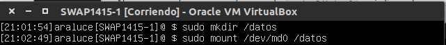
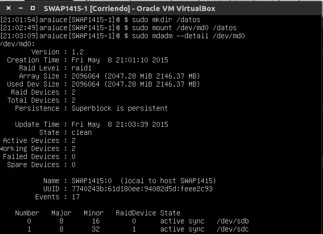

## Practica 6: _Discos en RAID_

Recursos disponibles para esta práctica:
***
DISCO DURO SO _UBUNTU SERVER 12_

DISCO DURO RAID1 _2GB_

DISCO DURO RAID2 _2GB_
***

##### 6.1 Preparación de la VM

Para la realización de esta práctica necesitamos una máquina con **SO** _Ubuntu Server 12_ a la que añadiremos dos discos duros del mismo tamaño para hacer el RAID.

De la misma forma creamos otro disco duro del mismo tamaño llamado RAID2.

Ahora comprobamos con el comando ``sudo fdisk -l`` qué discos tenemos:

Con estos resultados sabemos que nuestros discos tienen la misma capacidad y que se trata de los dispositivos **/etc/sdb** y **/etc/sdc**. Con estos datos podemos crear un raid1 _md0_.

Ya lo tenemos creado, ahora le damos formato con:

Por último, crearemos el directorio donde montaremos el Raid y lo montaremos:

Y con esto ya podemos hacer la comprobación:

