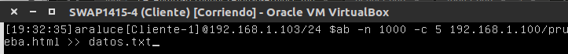
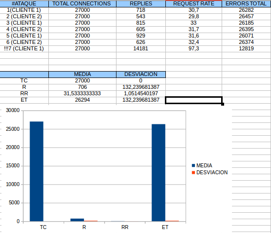

# swap1415

### Práctica 1: _Preparación de las herramientas_

#### Copiar el resultado de ejecutar: _apache2 -v_

***

Server version:	Apache/2.2.22 (Ubuntu)

Server built:	Jul 22 2014 14:37:02

***

#### Copiar el resultado de ejecutar: _ps aux | grep apache_

***

root		924	0.0	0.3	3404	6928 ?	Ss	18:41	0:00 /usr/sbin/apache2 -k start

www-data	983	0.0	0.8	34100	4456 ?	S	18:41	0:00 /usr/sbin/apache2 -k start

www-data	985	0.0	0.7	34068	3768 ?	S	18:41	0:00 /usr/sbin/apache2 -k start

www-data	988	0.0	0.7	34068	3768 ?	S	18:41	0:00 /usr/sbin/apache2 -k start

www-data	989	0.0	0.7	34068	3768 ?	S	18:41	0:00 /usr/sbin/apache2 -k start

www-data	994	0.0	0.7	34068	3768 ?	S	18:41	0:00 /usr/sbin/apache2 -k start

araluce		1613	0.0	0.1	4408	832 tty	S+	19:04	0:00 grep --color=auto apache

***

### Practica 2: _Replicar datos entre servidores_

#### Probar el funcionamiento de la copia de archivos por ssh


1. He creado un directorio _"directorio/"_ en la máquina 1
2. He ejecutado en la misma máquina el comando:

***
tar czf - directorio/ | ssh 192.168.1.3 'cat > ~/tar.tgz'
***

3. Con ese comando he comprimido el directorio _"directorio/"_ directamente en la máquina 1 a través del comando ssh

#### Clonado de una carpeta entre las dos máquinas


1. En la máquina 2 tenemos un directorio _"directorio"_ que contiene un archivo _"archivo.txt"_ y nuestro objetivo es clonarlo en la máquina 1

2. Desde la máquina 1 he ejecutado el comando:

***
rsync -avz -e ssh root@192.168.1.2:/home/araluce/directorio /home/araluce/
***

3. Como resutado de eso, el directorio _"directorio"_ ha sido clonado en la máquina 1 y podemos comprobar que el archivo _"archivo.txt"_ se encuentra dentro del directorio

#### Configuración de ssh para acceder sin que solicite contraseña


En este ejercicio voy a mostrar como crear un par de claves _(pública,privada)_ en una máquina y copiar desde otra máquina la clave pública de la primera máquina

1. En la máquina 2 creamos el juego de claves con el siguiente comando:

***
ssh-keygen -t dsa
***

2. Desde la máquina 1, copiamos la clave pública de la máquina 2 con el siguiente comando:

***
ssh-copy-id -i .ssh/id_dsa.pub root@192.168.1.2
***

3. Una vez copiada la clave pública, intentamos acceder a la máquina 2 por ssh para comprobarlo

***
ssh root@192.168.1.2
***

#### Establecer una tarea en _cron_ que se ejecute cada hora para mantener actualizado el contenido del directorio _/var/www_ entre las dos máquinas


1. La máquina 2 es la que va a lanzar el evento, por lo que necesitaremos la IP de la máquina 1 _(192.168.1.3)_

2. En la máquina 2 vamos a modificar el fichero /etc/crontab y añadimos la siguiente línea al final

00 1 *** root rsync -avz e ssh root@192.168.1.3:/var/www /var/www

### Practica 3: _Balanceo de carga_

Para esta práctica debemos configurar una tercera máquina, a la que llamamos _SWAP1415-3_, como balanceador de carga. Para ello nos dan dos opciones de balanceadores software (_nginx, haproxy_) que existen entre muchos otros.

El proceso de instalación y configuración de balanceadores descrito a continuación se llevará a cabo en _SWAP1415-3_. Pues bien, manos a la obra.

####1. _nginx_

Para instalar _nginx_ debemos importar la clave del repositorio de la siguiente manera:

cd /tmp/
wget http://nginx.org/keys/nginx_signing.key
apt-key add /tmp/nginx_signing.key
rm -f /tmp/nginx_signing.key

Después, como root, agregamos estas dos líneas al fichero source.list:


Después de guardar, con un _update_ y un install de nginx tendremos todo instalado. Ahora tenemos una máquina balanceadora que no está balanceando tráfico. Vamos a definir el/los grupos de máquinas con los que contamos para redirigirles el tráfico y a darles mayor cantidad a las máquinas más potentes o el mismo según nuestros intereses.

En nuestro caso tenemos dos servidores web _SWAP1415-1_ y _SWAP1415-2_. El primero es el doble de potente que el segundo, con lo cual queremos redirigirle al primero el doble de tráfico que al segundo. Sus IP's son 192.168.1.100 y 192.168.1.101 respectivamente. Muy bien, pues vamos a decirle a nginx con lo que contamos y cómo queremos hacerlo.

Editamos el fichero _/etc/nginx/conf.d/default.conf_ y definimos el grupo de servidores:


Y definimos la sección server (para que nginx utilice el grupo apaches que hemos definido) como sigue:

Antes de comprobar si funciona o no tendremos que


Ahora reiniciamos el servicio _nginx_ y comprobamos haciendo _curl [IP máquina balanceadora]_, en mi caso:

curl 192.168.1.102

Y nos devolverá lo siguiente:


Podemos observar cómo se redirige la mayor parte del tráfico a la máquina 1.

####2. _haproxy_

Instalamos _haproxy_


Y modificamos el fichero de configuración propio del balanceador de la siguiente manera:


Hecho esto, ya estamos listos para comprobar desde las máquinas _SWAP1415-1_ y _SWAP1415-2_ que el balanceador funciona correctamente, pero antes apagamos el servicio de _nginx_ y validamos la nueva configuración de _haproxy_


Y ahora si:


## Practica 4: _Comprobar el rendimiento de servidores web_

Recursos disponibles para esta práctica:
Servidor Web 1: 192.168.1.100
Servidor Web 2: 192.168.1.101
Balanceador   : 192.168.1.102
Cliente 1     : 192.168.1.103
Cliente 2     : 192.168.1.104

Antes de realizar ningún tipo de test, creamos una página en SW-1 y SW-2 contra la que atacar para hacer las pruebas de benchmarking:


####1. _Apache Benchmark (ab)_

En este apartado se vana ver involucrados el Servidor Web 1 _SWAP1415-1_ y el Cliente 1 _SWAP1415-4_.

Para comprobar que podemos acceder bien a la página prueba.html hacemos un curl al SW-1:


Hacemos el ataque, en mi caso he realizado 7 ataques. 1000 peticiones a prueba.html con concurrencia 5 y cada uno de los reportes se guarda en datos.txt para su posterior estudio.



Los resultados obtenidos en forma de tabla y gráfica son los siguientes:


Ahora realizamos el mismo ataque al balanceador. Comenzamos con el balanceador nginx.

Para eso debemos parar el servicio _haproxy_ e iniciar el servicio _nginx_

Los resultados para _nginx_ son:


Ahora paramos el servicio _nginx_ e iniciamos el servicio _haproxy_, los resultados obtenidos son los siguientes:


#### 2. _siege_

Instalamos _siege_ con el comando apt.

##### 2.1. Ataque al SW-1 _(SWAP1415-1)_
Procedemos a atacar directamente al servidor web desde la máquina cliente con este comando:


Los resultados son los siguientes:


##### 2.2. Ataque al balanceador nginx (SWAP1415-3)

Para esta sección haremos lo mismo que las veces anteriores. Paramos el servicio _haproxy_ y activamos _nginx_

El ataque lo realizamos de la misma forma pero al servidor 192.168.1.102. Los resultados que arrojan estos ataques son:


##### 2.2. Ataque al balanceador nginx (SWAP1415-3)

Los resultados que arrojan estos ataques son:


#### 3. _httperf_
Para poder instalar _httperf_ debemos añadir a /etc/apt/sources.list el siguiente repositorio:


No podremos instalar el paquete hasta que no hagamos un _"sudo apt-get update"_. Después de esto ya podremos instalar _httperf_con apt como haríamos con cualquier otro programa.

Después de esto, procedemos a realizar los ataques directamente al servidor web 1 _SWAP1415-1_ desde los clientes 1 y 2 simultáneamente (_SWAP1415-4_, _SWAP1415-5_)hasta completar un número de muestras suficiente.


Se ve que el ataque con el cliente 1 se realiza a 192.168.1.101, pero los resultados en las tablas y gráficas son ataques realizados desde los dos clientes a 192.168.1.100.

Los resultados obtenidos son los siguientes:



Es interesante el dato que arroja el ataque 7. Teniendo en cuenta que cada ataque se ha realizado simultáneamente con dos clientes y que el ataque 7, al ser impar, se ha realizado de forma independiente, el número de errores es mucho menor que el de otros ataques ejecutados desde dos clientes simultáneamente.

Puesto que los demás ataques se han realizado simultáneamente, este último dato va a descuadrar todas las estadísticas, así que lo pondremos como un dato interesante pero no lo metemos en el grupo de datos a los que vamos a hacer la media y desviación.

## Practica 5: _Replicación de bases de datos MySQL_

Recursos disponibles para esta práctica:
BD_server1: 192.168.1.100
BD_Server2: 192.168.1.101

##### 5.1 Creación de BD

Vamos a crear la tabla _datos_ en una base de datos en _BD_server1_ llamada _SWAPDB_


##### 5.2 Replica y recuperación de la BD _swapdb_

En esta sección crearemos una copia de seguridad y la pasaremos a **_BD_server2_** y le indicaremos a esta última que restaure los datos.

Antes de hacer la copia que va a copiar nuestra máquina2 bloqueamos la inserción de datos en la base de datos creada para que no se inserten datos mientras realizamos la copia.


Realizamos la copia en nuestro directorio **/root/**


Y desbloqueamos para poder insertar datos


Ahora desde la máquina **_BD_server2_** copiamos el archivo sql a nuestro directorio **/root/**


Antes de restaurar la copia debemos crear una BD con idéntico nombre a la que deseamos importar.


Y rellenamos los datos importando el fichero **_swapdb.sql_** que ahora se encuentra en nuestro directorio /root/


##### 5.3 Realizar configuración maestro-esclavo para replicación de datos automática

En un entorno real necesitamos que estas copias se realicen de forma automática. Podemos, para ello, configurar dos máquinas de modo que una de ellas asimile el rol de maestro y la otra de esclavo.

La configuración del maestro es sencilla. Simplemente debemos modificar como **root** el fichero de configuración de mysql **_/etc/mysql/my.conf_**. Para ello las siguientes directivas deben quedar así:

```
#bind-address 127.0.0.1
log_error = /var/log/mysql/error.log
server-id = 1
log_bin = /var/log/mysql/bin.log
```

Sin olvidarnos de reiniciar el servicio
``/etc/init.d/mysql restart``

Ahora debemos configurar de la misma forma la máquina que adquiere rol de esclavo.

El fichero a configurar es el mismo, con las mismas directivas salvo que el valor de **server-id** será dos. Ésto es ``server-id=2``

Además como la distribución de mysql es 5.5 no tenemos por qué definir los datos del **master**.


Después de reiniciar el servicio esclavo volvemos al maestro para definir un usurio y darle a ese usuario permisos de replicación de los datos.

Como antes, durante ese proceso vamos a bloquear consultas a las tablas para que durante este proceso no se produzcan errores. Con los datos obtenidos del maestro configuraremos el esclavo y lo activaremos.


No debemos olvidar volver a desbloquear las tablas en la máquina maestra para que puedan realizarse operaciones sobre ellas.

``mysql> UNLOCK TABLES``

Al introducir el comando **_SHOW SLAVE STATUS\G_** en la máquina esclava vemos que arroja un **Seconds_Behind_Master** distinto a _null_.


Podemos hacer la prueba añadiendo tablas al master y viendo cómo el esclavo hace la réplica.


## Practica 6: _Discos en RAID_

Recursos disponibles para esta práctica:
***
DISCO DURO SO _UBUNTU SERVER 12_

DISCO DURO RAID1 _2GB_

DISCO DURO RAID2 _2GB_
***

##### 6.1 Preparación de la VM

Para la realización de esta práctica necesitamos una máquina con **SO** _Ubuntu Server 12_ a la que añadiremos dos discos duros del mismo tamaño para hacer el RAID.


De la misma forma creamos otro disco duro del mismo tamaño llamado RAID2.

Ahora comprobamos con el comando ``sudo fdisk -l`` qué discos tenemos:


Con estos resultados sabemos que nuestros discos tienen la misma capacidad y que se trata de los dispositivos **/etc/sdb** y **/etc/sdc**. Con estos datos podemos crear un raid1 _md0_.


Ya lo tenemos creado, ahora le damos formato con:


Por último, crearemos el directorio donde montaremos el Raid y lo montaremos:


Y con esto ya podemos hacer la comprobación:


